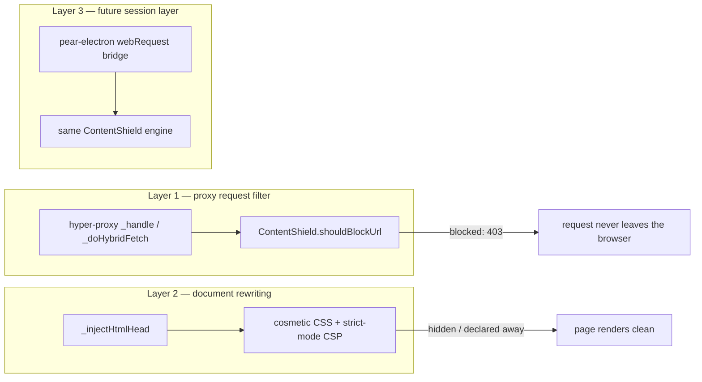

# PearBrowser → mainstream-browser parity plan

Status: Phases 1–3 shipped with gates closed; Phase 4 clearnet proxy + session-bridge facade shipped; Phase 5 privacy ladder shipped (HTTPS-only, tracking strip, farbling, cookie isolation in proxy mode). P2P distribution live 2026-07-16: filter-list drive subscriptions (`shield-list-sync.cjs`) and plugin installs from drives (`plugin-drive-loader.cjs` with the capability-escalation guard), plus the plugin catalogue (`plugin-catalog.cjs`, anonGPT in the builtin seed). All four distribution drives published, pinned, and fresh-peer verified — keys in `filter-lists/README.md`. The v3 native host now owns Electron directly. Remaining: wire the existing ContentShield contract to Electron's native `session.webRequest` only after a dedicated policy/RPC boundary and cross-platform GUI evidence are in place.
Date: 2026-07-16

The goal: make PearBrowser as capable a daily browser as Brave — ad blocking,
tracker protection, and a plugin/extension system — without giving up what
makes it different: P2P-first content, per-drive origin isolation, local AI,
and fail-closed capability gates.

This plan is grounded in the actual architecture, not in what a Chromium
browser would do. The constraints below decide everything.

## 1. Ground truth: what PearBrowser is today

- **Runtime split.** An Electron main process owns the window and lifecycle;
  an embedded Pear OTA worker runs the Bare backend (`index.js`); the renderer
  hosts the UI (`ui/shell.js`). They speak length-prefixed JSON RPC over a loopback
  WebSocket (ports 9876–9880).
- **Tabs are sandboxed `<iframe>`s**, not Electron `<webview>`s
  (`ui/shell.js`, `.webview` iframes; sandbox
  `allow-scripts allow-forms allow-same-origin allow-popups`).
- **All page bytes flow through a browser-owned loopback proxy.**
  `backend/hyper-proxy.js` serves `hyper://` drives over `bare-http1`, with
  per-drive `127.0.0.1:<port>` origins (`_ensureDriveOrigin`) and hybrid
  P2P/relay fetch (`_doHybridFetch`).
- **HTML responses pass one injection chokepoint.** `_injectHtmlHead()`
  injects `<base>`, tokens, and `window.pear.*` shims into every served HTML
  document, and re-writes the page CSP to hash-authorize exactly the scripts
  the browser injects (`injectCspShimHashes`) — never `unsafe-inline`.
- **Chromium's net stack is host-owned, but not yet policy-wired.** The
  Electron main process can register `session.webRequest`, but it must not do
  so until the browser's existing shield policy is exposed through a narrow,
  testable native-host boundary.
- **Clearnet `https://` sites are not browsable.** `CMD_NAVIGATE` maps
  non-loopback URLs onto `/hyper/<host>/…`, which 400s for non-drive hosts.
- **Capability permissions already exist.** Drive manifests declare
  permissions (`pear.ai.infer`); `http-bridge.js` `_hasAiPermission` +
  per-page `X-Pear-Token` enforce them fail-closed. This is the seed of the
  extension permission model.
- **No content filtering exists today** (grep-confirmed), and no extension
  loader of any kind.

## 2. Gap analysis vs Brave

| Capability | Brave | PearBrowser today | Parity path |
|---|---|---|---|
| Network ad/tracker blocking | adblock-rust on the Chromium net stack | none | Phase 1: proxy-level engine (done); Phase 4: session layer |
| Cosmetic filtering (element hiding) | CSS + scriptlet injection | none | Phase 1: `_injectHtmlHead` style injection (done) |
| Filter lists (EasyList etc.) | fetched + versioned | none | Phase 2: P2P-distributed lists over Hyperdrive |
| Per-site shield panel + counters | Shields UI | none | Phase 2: chrome panel fed by shield stats |
| Extensions | Chrome Web Store (MV2/MV3 subset) | none | Phase 3: P2P extension model on manifest+token gates |
| Clearnet browsing | native | not browsable | Phase 4: pear-electron session bridge |
| HTTPS upgrades, fingerprint defenses | native shields | n/a until clearnet | Phase 4/5 |
| Private local AI | Leo (remote by default) | **ahead**: QVAC on-device, token-gated | keep lead |
| Origin isolation | site-per-process | per-drive loopback origins | keep; extend to extensions |

Two honest observations follow from the table:

1. **For `hyper://` content, PearBrowser can reach Brave-grade blocking
   entirely in app code**, because every request either passes the proxy
   (first-party) or can be declared away with CSP (third-party). No fork
   needed.
2. **For clearnet parity, there is no app-code-only path.** The iframe +
   loopback-proxy design cannot render arbitrary `https://` sites (cookies,
   service workers, TLS origin semantics, X-Frame-Options all break). That
   work lands in the pear-electron layer, and the page-facing contracts
   built in Phases 1–3 must be transport-independent so they survive the
   move.

## 3. Blocking architecture: three enforcement layers

- **Layer 1 (implemented)** — `backend/content-shield.cjs` evaluates every
  proxied request (`/hyper/*`, `/app/*`, drive-origin ports) before any
  P2P/relay fetch. Blocked requests answer `403` with an `X-Pear-Shield`
  header and never touch the swarm — saving bandwidth, battery, and privacy.
- **Layer 2 (implemented)** — the same engine contributes a per-host
  cosmetic CSS block injected next to the existing shims, and (strict mode)
  a CSP `<meta>` that confines third-party subresources — the one class of
  request the proxy can never see, because Chromium fetches
  `https://tracker/ad.js` directly from inside the iframe.
- **Layer 3 (planned)** — when the pear-electron session bridge exists, the
  identical `ContentShield` engine moves in front of the Chromium net stack.
  The rule format, settings, and stats contracts are already
  transport-independent, so Layers 1–2 keep working for hyper:// while
  Layer 3 adds clearnet.

## 4. Phase 1 — Content Shield foundation (implemented in this change)

**Engine** — `backend/content-shield.cjs`:

- Parses a pragmatic subset of Adblock-Plus filter syntax plus hosts-file
  lines: `||domain^` anchors, plain substring rules, `@@` exceptions,
  `##selector` global and `domain##selector` scoped cosmetic rules,
  `0.0.0.0 host` entries, comments (`!`, `#` for hosts lines).
- `shouldBlockUrl(url)` → `{ blocked, rule }`; exceptions always win;
  matching is case-insensitive on a normalized URL.
- `cosmeticCssFor(host)` returns one deduplicated
  `selector,… { display: none !important; }` block per document host.
- Ships a small built-in seed list of unambiguous ad/tracker hosts
  (doubleclick, googletagmanager, google-analytics, adsystem,
  connect.facebook.net, hotjar, criteo, taboola, outbrain, …) so the shield
  is useful before list infrastructure exists. User lists append at runtime
  via `addList(name, text)`.
- Counters: `stats()` reports blocked/allowed totals and per-rule hits, for
  the Settings card and the future per-site panel. No URLs are retained —
  counters only, so the shield never becomes a browsing log.

**Wiring** — `backend/hyper-proxy.js`:

- `setContentShield(shield)` hands the proxy a shield instance.
- `_handle()` consults it for every `/hyper/*` and `/app/*` request with the
  reconstructed `hyper://<key>/<path>` URL; blocked → `403` + counter, no
  fetch.
- `_injectHtmlHead()` appends `<style data-pear-shield>` with the cosmetic
  block when the shield is enabled.

**Settings and RPC** — persisted in existing user-data settings
(`contentShield: true|false`, default **on**; `contentShieldStrict`
reserved): backend applies on boot and on every settings write;
`CMD_SHIELD_STATUS` returns `{ enabled, stats }` for the UI. A Settings
card exposes the toggle and live counters.

**Tests** — `test/content-shield.test.js` covers parsing, blocking,
exceptions, cosmetic scoping, hosts syntax, counters, and disabled-mode
pass-through; a proxy-level test asserts 403-before-fetch and cosmetic
injection.

Exit criteria (met): engine passes unit suite; blocked subresource requests
never reach `_doHybridFetch`; disabling the shield restores byte-identical
behavior; cosmetic CSS rides the existing CSP-safe injection path (a
`<style>` element needs no script hash).

## 5. Phase 2 — filter-list infrastructure and Shields UX

1. **P2P list distribution (the on-brand move).** Publish curated filter
   lists (EasyList/EasyPrivacy conversions + a Pear-native list) as an
   immutable, versioned Hyperdrive pinned by HiveRelay — the same mechanism
   that ships the homepage drive. The browser subscribes to the list drive
   key, verifies length/checksum, hot-swaps rules without restart, and
   works fully offline after first sync. No CDN, no fingerprintable list
   fetches against a vendor server.
2. **Per-site shield panel.** A urlbar chip (mirroring the ✦ Ask toggle
   pattern) showing blocked-count for the active tab; per-drive
   allowlisting stored in user-data (`shieldAllow:<driveKey>`), enforced in
   `shouldBlockUrl` via a document-key parameter.
3. **Strict third-party mode.** Inject a
   `Content-Security-Policy` meta confining `script-src/img-src/connect-src`
   to the page's loopback origin for drives the user marks strict —
   closing the third-party gap Layer 1 cannot see. Default off per drive
   (some legitimate hyper sites embed clearnet media), one-click from the
   shield panel.
4. **Scriptlet injection.** Port the small class of uBlock scriptlets
   (set-constant, abort-on-property-read) through the existing
   hash-authorized shim pipeline (`sha256ScriptBody` → CSP hash → inject).

## 6. Phase 3 — extensions ("Pear Plugins")

Design principle: **extensions are Hyperdrive apps with extra capabilities**,
not Chrome extensions. The whole loader already exists — drives, manifests,
capability gates, tokens, consent UI. What's new is the vocabulary and the
injection surfaces.

1. **Packaging.** A plugin is a drive with `/manifest.json` declaring
   `pear.plugin` metadata plus requested capabilities:
   `pear.content.styles` (cosmetic CSS per matched host),
   `pear.content.scripts` (content scripts), `pear.net.filter`
   (contribute filter rules), `pear.panel` (chrome side-panel UI),
   `pear.ai.infer` (already exists — plugins get local AI for free).
   Install = pin the drive (the app-pinning path already staged for apps),
   verify author signature (author-signed verification badge already
   exists in the Apps UI).
2. **Enforcement.** Content scripts/styles are injected by
   `_injectHtmlHead` per matched host, hash-authorized in CSP exactly like
   the browser's own shims — a plugin script is provably the bytes the user
   installed. Network-filter contributions feed the same `ContentShield`
   engine with per-plugin rule namespaces and per-plugin kill switches.
   Panels render in the chrome as iframes on the plugin's own loopback
   origin (per-drive origin isolation already provides the sandbox).
3. **Consent + revocation.** Reuse the Permission Center section in
   Settings: per-plugin capability list, per-host grants, one-click
   disable. Grants keyed to drive key, never display name (same rule the
   AI gate follows).
4. **Update model.** Plugins are drives — updates arrive over the swarm;
   the browser re-verifies manifest + signature and diffs requested
   capabilities, prompting only on escalation. (Brave cannot do silent
   *capability* escalation detection this cleanly; drive versioning gives
   it to us for free.)
5. **Explicit non-goals.** No Chrome Web Store compatibility, no arbitrary
   `webRequest` blocking API for plugins (rule contributions only), no
   plugin access to other drives' DOM or tokens.

## 7. Phase 4 — clearnet browsing and the session bridge

The only path to "browse anything like Brave" is teaching the pear-electron
layer to host real web content:

1. **Upstream a narrow bridge, not a fork if avoidable.** Propose a
   pear-electron API: `runtime.createWebView({ partition })` (Electron
   `<webview>`/`WebContentsView`) plus
   `runtime.onBeforeRequest(filter, handler)` bridged to the Bare backend
   over the existing runtime pipe. Only if upstream stalls: maintain a
   patched boot bundle (pear-electron documents its bundle build scripts;
   the patch surface is ~two APIs).
2. **Tab model.** Clearnet tabs render in `<webview>`s with per-site
   partitions; hyper tabs keep the loopback-proxy iframes (better isolation
   than Chromium default, and battle-tested here). The `ui/lib/tabs.js`
   model already carries per-tab kind flags.
3. **Shield goes native.** `ContentShield` evaluates
   `onBeforeRequest` for clearnet requests — same rules, same stats, same
   settings. Consider swapping the JS engine for `adblock-rust` via a Bare
   native addon only if profiling demands it.
4. **Then the Brave privacy ladder, in order:** HTTPS-only mode; referrer
   trimming + query-param stripping; third-party cookie blocking (partition
   default); basic fingerprint farbling (canvas/audio noise per
   partition); optional Tor-style transport is out of scope.

## 8. Sequencing and gates

| Phase | Scope | Gate to advance |
|---|---|---|
| 1 (done) | Shield engine + proxy wiring + settings + tests | full desktop suite green |
| 2 (**gate closed 2026-07-16**) | P2P lists (`shield-list-sync.cjs`, subscribe/refresh/offline restore, Settings UI), shield panel, strict mode, allowlists | pear-default list drive published + pinned + fresh-peer verified (`842fb9e6…`, see `filter-lists/README.md`); hot-swap + offline proven in `test/shield-list-sync.test.js` |
| 3 (**gate closed 2026-07-16**) | Plugin manifest vocabulary, drive installs (`plugin-drive-loader.cjs`), escalation guard, kill switch, Settings UI, plugin catalogue (`plugin-catalog.cjs` — builtin seed with anonGPT + drive-loadable `/plugins.json` sources, one-click install/open UI) | two real plugins shipped from drives: dark-reader `bbde8330…` + peerit-enhancer `1b21d8a6…`, catalogue drive `01b74736…`, all pinned + fresh-peer verified |
| 4 | pear-electron session bridge, clearnet tabs, native shield | upstream decision or maintained patch + release smoke on all targets |
| 5 | privacy ladder (HTTPS-only, fingerprinting, cookies) | per-feature web-compat smoke |

Phases 1–3 are pure app code and de-risk immediately. Phase 4 is the single
structural dependency, so it starts as a conversation with the pear-electron
maintainers now while 2–3 ship value to hyper:// browsing.

## 9. Test matrix (cumulative)

- Engine: rule parsing (each syntax form), exception precedence, host
  scoping, malformed-line tolerance, counter integrity, large-list
  performance (100k rules < 50ms cold parse target).
- Proxy: blocked request short-circuits before hybrid fetch; 403 carries
  no drive bytes; HTML cache HIT and MISS both carry cosmetic CSS;
  disabled shield restores identical bytes.
- Settings: toggle round-trip, boot-time application, per-drive allowlist.
- Plugins (Phase 3): capability escalation prompts, kill switch, CSP hash
  verification of injected scripts, cross-drive isolation.
- Clearnet (Phase 4): shields on real ad-heavy pages, partition isolation,
  no proxy regression for hyper:// tabs.
