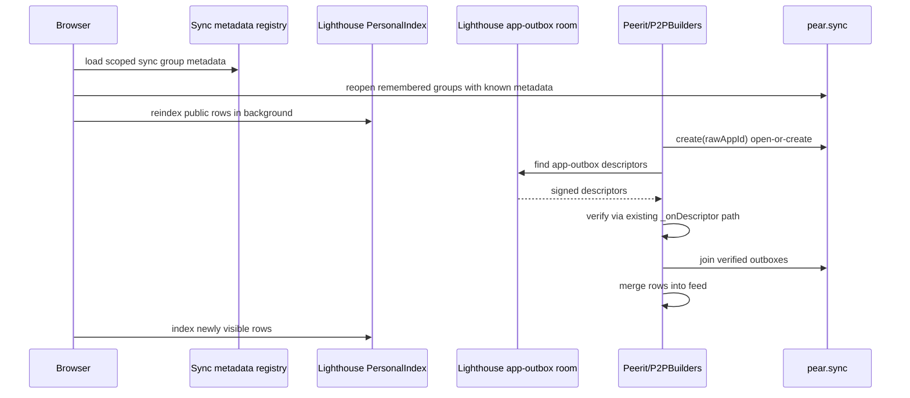
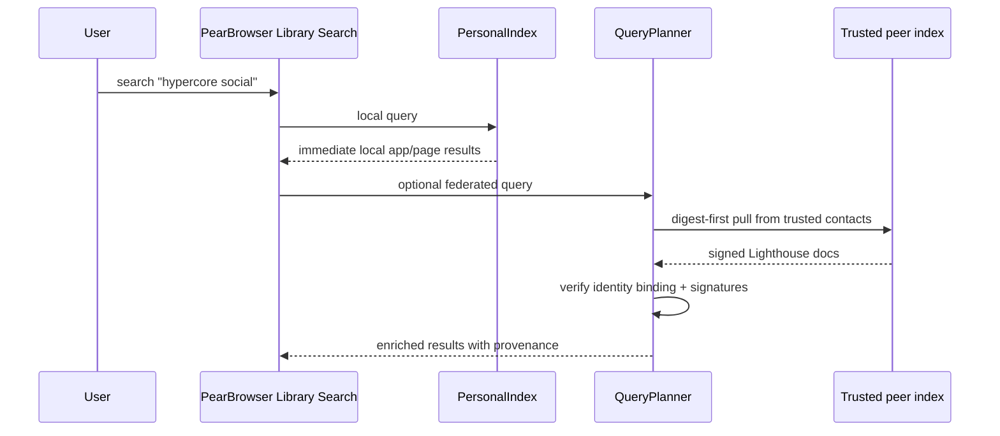

# Lighthouse App Data Discovery Plan

Date: 2026-06-24

Scope: use the existing Lighthouse search/index stack plus the recent
PearBrowser sync-group recovery fixes to make app data, especially Peerit and
P2PBuilders, searchable, discoverable, and durable across restarts and offline
peers.

## Executive Summary

The recent fix addresses the immediate data-loss symptom: a site can lose its
page-local outbox key after the old random proxy origin changes, but
`pear.sync.create(appId)` now reopens the browser-remembered sync group and both
Peerit and P2PBuilders call it as an open-or-create path.

That is necessary, but it is not the whole product-quality story. It recovers
the user's known local outbox. It does not, by itself:

- discover other users' outboxes when those users are offline;
- classify remembered sync groups by source app without extra metadata;
- keep public app data available when the author device is offline;
- make posts/comments searchable from PearBrowser's global search;
- prove that a search result came from a valid app record rather than from an
  unverified index row.

Lighthouse should become the shared app-data discovery layer:

1. Browser observes app sync writes and indexes public app records into the
   existing PersonalIndex Hyperbee.
2. Apps publish signed outbox descriptors into a small Lighthouse descriptor
   room, not into the full-text index.
3. On app startup, apps query Lighthouse for known descriptors, verify them,
   join those sync groups, then merge normally.
4. Browser or an always-on seeder pins selected outbox cores to HiveRelay and
   records durability evidence.
5. Search results point back into the app route, for example
   `hyper://<peerit-drive>/#/r/p2p/comments/<cid>`.

This preserves the core rule from Lighthouse: rooms are indexes, not authority.
Every descriptor and every indexed record must be re-verified before it can
populate app state or rank in search.

## Implementation Status - 2026-06-24

Shipped in the production PearBrowser release at length `33841`:

- `backend/app-sync-registry.cjs` persists sync metadata beside the existing
  Pear bridge invite-key cache: scoped app id, serving app drive, raw app id,
  derived app slug, invite key, and timestamps.
- `HttpBridge` records that metadata on `/api/sync/create` and
  `/api/sync/join`, then calls the app data indexer after successful
  `/api/sync/append`.
- `backend/app-data-indexer.cjs` indexes public Peerit and P2PBuilders
  communities/boards, posts, and comments into Lighthouse `PersonalIndex`
  documents, with launchable `hyper://.../#/...` app routes.
- Known app groups are re-scanned on browser startup, bounded by group and row
  caps, so remembered app data can repopulate search after relaunch.
- Tombstoned posts/comments remove their Lighthouse documents.
- `CMD_NAVIGATE` preserves URL hashes in proxied `hyper://` iframe URLs, so
  app search results open the intended Peerit/P2PBuilders route.

Verification:

- Focused implementation tests: 13/13 passing.
- Full desktop suite: 455/455 passing.
- Production release: `pear://tco5k7h38uoxatedp1wongdbhjxow1x7jiwm3t1i9cujbebhsbty`
  at length `33841`.
- Fresh-peer release-content scan: length `33841`, 10250 entries, forbidden
  operator paths absent.
- Live catalogue check: Hyperbee length `273`, 14 apps, Peercord/peerit/HiveWorm
  rows present.

Still future work:

- Signed outbox descriptor room for cross-user discovery when an app author is
  offline.
- Descriptor verification against app record signatures before auto-joining or
  trust-ranking third-party outboxes.
- HiveRelay pinning of selected outbox cores and explicit durability evidence.

## What Already Exists

### Lighthouse search primitives

The browser already has:

- `backend/search-core.cjs`: tokenizer, signed per-document index records,
  `t!<term>!<invScore>!<docId>` range scans, deterministic ranking.
- `backend/personal-index.cjs`: the per-user Hyperbee index that stores browsed
  documents and builds the digest tier.
- `backend/search-digest.cjs`: digest-first fan-out so trusted peers do not need
  to replicate full indexes for every query.
- `backend/identity-binding.cjs` and
  `backend/identity-binding-publisher.js`: root-to-search-key binding, DHT
  publication, completeness anchors, and digest publication.
- `backend/query-planner.js`: local-first search plus trusted-peer fan-out.
- `backend/search-handler.js`: returns local results immediately, then emits
  enriched federated results asynchronously.

The existing browser UI already indexes browsed `hyper://` pages through
`CMD_SEARCH_INDEX`. That works for rendered pages, but app records deserve a
more precise path because their structured data passes through `pear.sync`.

### PearBrowser sync recovery

The browser bridge now persists sync groups in
`pear-bridge-sync-groups.json`, and `createSyncGroup(appId)` reopens a
remembered group before minting a new one.

Important detail: the HTTP bridge scopes every app's raw appId by the drive key:

```text
scopedAppId = sha256(appDriveKeyHex + ':' + rawAppId)
```

This is good isolation. The same raw appId in two different apps cannot collide.
It also means a clean Lighthouse layer should persist metadata alongside the
scoped id:

```json
{
  "scopedAppId": "sha256(appDriveKey:rawAppId)",
  "appDriveKey": "64 hex",
  "rawAppId": "author/app pubkey or logical app id",
  "appSlug": "peerit",
  "inviteKey": "64 hex",
  "lastSeenAt": 1780000000000
}
```

Without this sidecar, an old remembered scoped group can be reopened but cannot
be confidently classified as Peerit/P2PBuilders until the app touches it again.

### Peerit and P2PBuilders app model

Both apps use signed records stored in per-user outboxes:

- Peerit: `community`, `post`, `comment`, `vote`, `profile`, `modaction`.
- P2PBuilders: `board`, `post`, `comment`, `vote`, `profile`, `follow`,
  `block`, `blocklist`.

Both apps already publish live swarm descriptors shaped like:

```json
{
  "t": "outbox-desc",
  "pub": "author pubkey",
  "appId": "author pubkey",
  "inviteKey": "sync invite key",
  "sig": "descriptor signature",
  "dk": "app identity drive key",
  "ns": "app signature namespace"
}
```

Those descriptors are the right starting point. Today they are live gossip only.
Lighthouse should make them durable and queryable.

## Proposed Architecture

### Layer 0: remembered local groups

Keep the current fix:

- `pear.sync.create(appId)` is open-or-create.
- apps call it when page-local `localStorage` has no invite key.
- browser persists remembered sync groups.
- app-side tests continue to cover restart without page-local outbox key.

Add a browser sync metadata registry:

```text
backend/app-sync-registry.cjs
```

Responsibilities:

- record raw app context when `/api/sync/create` or `/api/sync/join` is called;
- map `scopedAppId -> { appDriveKey, rawAppId, appSlug, inviteKey }`;
- expose remembered groups to startup jobs and diagnostics;
- migrate opportunistically as apps are opened again.

This registry is the missing bridge between "we can reopen this group" and
"we know this group belongs to Peerit/P2PBuilders."

### Layer 1: AppDataIndexer in the browser

Add a first-party browser indexer:

```text
backend/app-data-indexer.cjs
```

Inputs:

- sync append events from `HttpBridge` after successful `/api/sync/append`;
- startup scans over remembered groups with known app metadata;
- explicit app-triggered reindex requests for backfill.

Outputs:

- Lighthouse PersonalIndex docs via `personalIndex.indexDoc(...)`;
- app-data metadata in the PersonalIndex, such as last indexed key/version.

Why it belongs in the browser:

- every app sync write already crosses `HttpBridge`;
- the browser has the PersonalIndex and identity binding;
- apps do not need to reimplement Lighthouse indexing;
- app data becomes searchable from the Library search without app-specific UI
  hacks.

Adapter contract:

```js
{
  appSlug: 'peerit',
  appDriveKey: '<drive key>',
  matchRecord(key, value) -> boolean,
  verifyRecord(key, value) -> boolean,
  toSearchDoc({ key, value, appDriveKey, rawAppId }) -> {
    driveKey,
    path,
    title,
    body,
    publishedAt,
    link
  }
}
```

Example Peerit mapping:

```text
community!p2p
  title: "r/p2p"
  body: title + description
  link: hyper://<peerit-drive>/#/r/p2p

post!p2p!<cid>
  title: post.title
  body: post.body or post.url
  link: hyper://<peerit-drive>/#/r/p2p/comments/<cid>

comment!p2p!<postCid>!<cid>
  title: "Comment on <post title if known>"
  body: comment.body
  link: hyper://<peerit-drive>/#/r/p2p/comments/<postCid>
```

Example P2PBuilders mapping:

```text
board!front
  title: "b/front"
  body: description
  link: hyper://<p2pb-drive>/#/b/front

post!front!<cid>
  title: post.title
  body: post.text or post.url
  link: hyper://<p2pb-drive>/#/b/front/item/<cid>

comment!<postCid>!<cid>
  title: "Comment"
  body: comment.body
  link: hyper://<p2pb-drive>/#/b/<board>/item/<postCid>
```

Index only public record types by default:

- yes: communities/boards, posts, comments, public profiles;
- maybe: public blocklists and follows, behind a UI flag;
- no: local preferences, local blocks, hidden lists, private app data.

### Layer 2: signed outbox descriptors in Lighthouse

Create a bounded descriptor schema for app outboxes. This belongs in a
schema-sheets/Autobee style room because it is small, signed metadata, not a
per-record corpus.

Schema sketch:

```json
{
  "kind": "app-outbox",
  "v": 1,
  "appSlug": "peerit",
  "appDriveKey": "64 hex",
  "rawAppId": "author pubkey or logical app id",
  "scopedAppId": "sha256(appDriveKey:rawAppId)",
  "inviteKey": "64 hex",
  "authorPubkey": "64 hex",
  "recordTypes": ["community", "post", "comment"],
  "updatedAt": 1780000000000,
  "head": {
    "viewLength": 1234
  },
  "sig": "author/app signature"
}
```

Verification rules:

1. descriptor `authorPubkey` must match the app record signer;
2. descriptor signature must verify under the app's signature namespace;
3. `appDriveKey` must match the drive that served the app;
4. `scopedAppId` must equal `sha256(appDriveKey:rawAppId)`;
5. invalid descriptors are dropped before joining or indexing.

Do not put every post/comment into a descriptor room. The existing Lighthouse
research is clear: schema-sheets rooms are for hundreds to low-thousands of
descriptor rows. Per-record and full-text data belongs in Hyperbee indexes and
sync outboxes.

### Layer 3: app startup population

Add an app-side startup phase:

```text
ready()
  open my outbox
  rejoin locally remembered outboxes
  query Lighthouse for signed app-outbox descriptors
  pass every descriptor through the existing _onDescriptor verifier
  join verified outboxes
  merge rows
```

The key design choice is reuse: Peerit and P2PBuilders already have an
`_onDescriptor` path that verifies and joins an outbox. Lighthouse should feed
that same path. There should not be a second trust path for startup discovery.

Potential page API:

```js
window.pear.lighthouse.outboxes.find({
  appSlug: 'peerit',
  appDriveKey,
  limit: 500
})

window.pear.lighthouse.outboxes.publish(descriptor)
```

The browser may also auto-publish descriptors when a sync group is created or
joined, but app-authored descriptors remain important because the app can sign
them with the same identity that signs its records.

### Layer 4: durability and pinning

Searchability is not the same as availability. A Lighthouse descriptor can tell
the app which outbox exists, but a peer still needs someone to serve the blocks.

Add an explicit app-data pinning path:

```text
pear.sync.pin(appId, { durability: 'archive' })
```

or first-party browser command:

```text
CMD_SYNC_PIN_GROUP
```

Responsibilities:

- seed the outbox core(s) to HiveRelay;
- wait for remote length evidence, not just seed acceptance;
- store pin status in the sync metadata registry;
- surface status in app settings: local only, seeded, relay-confirmed,
  stale/unconfirmed.

Open technical choice:

- immediate path: reuse the existing seeder logic and raw-core HiveRelay seed
  proof;
- cleaner long-term path: make raw Autobase/Hyperbee cores first-class
  AutoHeal targets, or wrap public app-data mirrors in a Hyperdrive-shaped
  capsule so HiveRelay's existing archive durability machinery applies.

The product copy should be honest:

```text
Searchable means indexed.
Discoverable means Lighthouse can find the outbox descriptor.
Available means at least one online peer or relay can serve the outbox blocks.
```

## Startup Flow



## Search Flow



App data results are ordinary Lighthouse search results with app links:

```json
{
  "title": "Autobase is underrated",
  "body": "Multi-writer logs...",
  "link": "hyper://<peerit-drive>/#/r/holepunch/comments/<cid>",
  "source": {
    "kind": "app-data",
    "appSlug": "peerit",
    "recordKey": "post!holepunch!<cid>",
    "outbox": "<author pubkey>"
  }
}
```

## Implementation Slices

### Slice 1: registry and observer

- Add `backend/app-sync-registry.cjs`.
- Teach `HttpBridge` to persist `{ driveKeyHex, rawAppId, scopedAppId,
  inviteKey }` on create/join.
- Add an `onSyncAppend` hook to `HttpBridge` after successful append.
- Unit test scoped metadata persistence and migration.

Outcome: the browser knows which app each sync group belongs to and can observe
new app records.

### Slice 2: local app-data indexing

- Add `backend/app-data-indexer.cjs`.
- Add Peerit and P2PBuilders adapters.
- Index public records into `PersonalIndex`.
- Reindex remembered known groups on browser boot in a capped background task.
- Unit test record mapping, route generation, and privacy allowlist.

Outcome: posts/comments/boards become searchable in PearBrowser Library search
after they are written or discovered locally.

### Slice 3: descriptor room

- Add `app-outbox` descriptor schema.
- Add browser commands:
  - `CMD_LIGHTHOUSE_OUTBOX_PUBLISH`
  - `CMD_LIGHTHOUSE_OUTBOX_FIND`
- Store descriptors in a bounded Lighthouse room.
- Reuse app `_onDescriptor` validation on the page side.
- Unit test malformed descriptor rejection and appDriveKey/scopedAppId binding.

Outcome: app startup can populate from known public outboxes even when no live
peer happens to announce over swarm at that moment.

### Slice 4: pinning and availability

- Add `CMD_SYNC_PIN_GROUP` or `pear.sync.pin`.
- Seed outbox cores to HiveRelay with archive durability.
- Wait for remote length evidence.
- Store pin evidence in sync metadata.
- Show status in app settings.

Outcome: public app data can be discoverable and available while the author is
offline.

### Slice 5: trust and provenance UX

- Add source chips:
  - `you`
  - `local app data`
  - `trusted contact`
  - `lighthouse descriptor`
  - `relay-confirmed`
- Distinguish app record author from index publisher.
- Cap ranking for unverified third-party descriptors.

Outcome: users can tell why a result is visible and how strong the trust path is.

## Security Notes

- The descriptor room is never authoritative. It only supplies candidates.
- Joining an outbox from a descriptor must reuse the app's existing descriptor
  verifier.
- Indexed app records should be verified with app-specific record rules before
  they rank above low-trust hints.
- The PersonalIndex signature means "this browser indexed this document"; it is
  not automatically proof that the original app record author wrote it. Store
  original app record provenance separately.
- Do not index private app-local state by default.
- Do not do unbounded startup scans. Use pagination, per-app caps, and persisted
  cursors.
- Do not rely on seed acceptance as durability proof. Require remote length or
  equivalent block possession evidence.

## Recommended First Commit

Start with Slice 1 and Slice 2:

1. Add the sync metadata registry.
2. Add `AppDataIndexer`.
3. Add Peerit and P2PBuilders adapters.
4. Hook `HttpBridge` append/create/join.
5. Add tests for:
   - appId scoping metadata;
   - Peerit post/comment indexing;
   - P2PBuilders post/comment indexing;
   - search result links;
   - privacy allowlist;
   - restart reindex from remembered groups.

This gives immediate value without requiring a new distributed room: app data
already seen by the browser becomes searchable and survives restarts. Then add
the Lighthouse outbox descriptor room to make remote/offline population clean.
